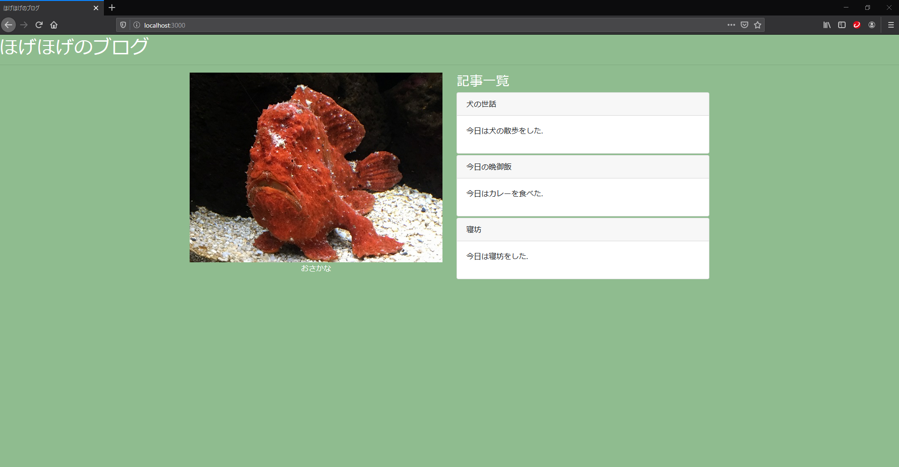

# スクレイピング

## プログラム概要

Selenium(Chrome、FireFox)とPuppeteer(Chromium)を使って、Webページの情報を取得する.

```http://localhost:3000/```　にプログラムでアクセスし、表示されている記事の情報を取得する.

以下のページをスクレイピングする.



使用するブラウザは以下の3種類である.

1. Google Chrome (Selenium)
2. Fire Fox (Selenium)
3. Chromium (Puppeteer)

スクレイピングで取得した記事情報はコンソールとログファイルに出力する.
また、スクレイピング時にスクリーンショットを保存する.

## Seleniumの環境構築

### node_modulesのインストール

以下のコマンドを実行してインストールする.

```sh
npm i --save selenium-webdriver
npm i --save-dev @types/selenium-webdriver
```

### Driverインストール

#### ドライバーのフォルダ構成

ドライバーを以下のように配置する.

```sh
drivers/
 ├─chromedriver_win32
 │ └─chromedriver.exe
 │
 └─geckodriver-v0.26.0-win64
   └─geckodriver.exe
```

プログラム上でのドライバーの読み取り設定は、
**src\scraping\selenium\config.ts**に直接記入している.

#### Chrome

<https://sites.google.com/a/chromium.org/chromedriver/downloads>

以下のURLよりダウンロードする.

<https://chromedriver.storage.googleapis.com/index.html?path=80.0.3987.16/>

#### FireFox

以下のURLよりダウンロードする.

<https://github.com/mozilla/geckodriver/releases/tag/v0.26.0>

## Puppeteerのインストール

以下のコマンドを実行してインストールする.

```sh
npm i --save puppeteer
npm i --save-dev @types/puppeteer
```

## スクレイピング方法

### スクレイピング対象のページ

記事の一覧は以下のようなHTMLになっている.

```html
<div>
  <div class="card panel-default">
    <div class="card-header">犬の世話</div>
    <div class="card-body">
      <p>今日は犬の散歩をした.</p>
    </div>
  </div>
  <div class="card panel-default">
    <div class="card-header">今日の晩御飯</div>
    <div class="card-body">
      <p>今日はカレーを食べた.</p>
    </div>
  </div>
  <div class="card panel-default">
    <div class="card-header">寝坊</div>
    <div class="card-body">
      <p>今日は寝坊をした.</p>
    </div>
  </div>
</div>
```

各記事の情報を取得するには、以下の処理を行う.

1. クラスが```card```のdivタグを取得する.

2. タイトルはクラスが```card-header```のdivタグからとってくる.

3. 本文はクラスが```card-body```のdivタグからとってくる.

### Seleniumの場合

driverのfindElementsでDOMを取得し、データを成形する.

```typescript
 const divs = await driver.findElements(By.className('card'));
    for (const div of divs) {
      const header = await div.findElement(By.className('card-header'));
      const body = await div.findElement(By.className('card-body'));

      const title = await header.getText();
      const description = await body.getText();
      articles.push({
        title,
        description,
      });
    }
```

### Puppeteerの場合

pageのevaluateメソッド内でDOMを取得し、データを成形する.

※ evaluateメソッド内の処理をTypeScriptで書くことはできるが、
evaluateメソッドを呼び出す側のTypeScriptとは独立していることに注意する必要がある.
(例. Articleインタフェースをevaluate内で宣言することができない)

```typescript
   const articles: Article[] = await page.evaluate(() => {
      const divs = document.querySelectorAll('.card');
      const articles: { title: string; description: string }[] = [];
      for (const div of divs) {
        const title = div.querySelector('.card-header')?.textContent;
        const description = div.querySelector('.card-body')?.textContent;
        if (title && description) {
          articles.push({
            title,
            description,
          });
        }
      }
      return articles;
    });
```

## コンパイル

以下のコマンドを実行するとdistフォルダにJSファイルが生成される.

```sh
npm run build
```

## 実行

### (準備)サーバを立てる

以下のコマンドを実行する.

```sh
cd server
npm install # 初回のみ
npm run start
```

### スクレイピングの実行

リポジトリ直下で以下のコマンドを実行する.

```sh
npm run start
```

結果

```log
> node ./dist/index.js

[2020-02-07T22:50:47.738] [INFO] puppeteer-blog - getArticlesが呼び出されました.
[2020-02-07T22:50:47.742] [INFO] puppeteer-blog - ヘッドレスブラウザを起動します.
[2020-02-07T22:50:49.787] [INFO] puppeteer-blog - URL http://localhost:3000/に遷移します.
[2020-02-07T22:50:49.979] [INFO] puppeteer-blog - 遷移結果 (Status Code = 200)
[2020-02-07T22:50:49.982] [INFO] puppeteer-blog - スクリーンショットを取ります. ファイル名は logs\puppeteer-20200207_225049.pngです.
[2020-02-07T22:50:51.088] [INFO] puppeteer-blog - スクリーンショットを取りました. ファイル名は logs\puppeteer-20200207_225049.pngです.
[2020-02-07T22:50:51.090] [INFO] puppeteer-blog - 記事を取得します.
[2020-02-07T22:50:51.126] [INFO] puppeteer-blog - 記事を取得しました.
[2020-02-07T22:50:51.549] [INFO] runPuppeteer - [
  { title: '犬の世話', description: '今日は犬の散歩をした.' },
  { title: '今日の晩御飯', description: '今日はカレーを食べた.' },
  { title: '寝坊', description: '今日は寝坊をした.' }
]
[2020-02-07T22:50:51.551] [INFO] runPuppeteer - Puppeteer Execution time (hr): 3s 813.145001ms
[2020-02-07T22:50:51.553] [INFO] selenium-blog-Chrome - getArticlesが呼び出されました.
[2020-02-07T22:50:51.586] [INFO] selenium-blog-Chrome - ヘッドレスブラウザを起動します.

DevTools listening on ws://127.0.0.1:53800/devtools/browser/2b3e13ec-8db4-4244-84e3-316af0294de7
[2020-02-07T22:50:57.399] [INFO] selenium-blog-Chrome - URL http://localhost:3000/に遷移します.
[2020-02-07T22:50:57.813] [INFO] selenium-blog-Chrome - スクリーンショットを取ります. ファイル名は logs\selenium-Chrome-20200207_225057.pngです.
[2020-02-07T22:50:59.628] [INFO] selenium-blog-Chrome - スクリーンショットを取りました. ファイル名は logs\selenium-Chrome-20200207_225057.pngです.
[2020-02-07T22:50:59.629] [INFO] selenium-blog-Chrome - 記事を取得します.
[2020-02-07T22:50:59.826] [INFO] selenium-blog-Chrome - 記事を取得しました.
[2020-02-07T22:50:59.931] [INFO] runSelenium(Type:Chrome) - [
  { title: '犬の世話', description: '今日は犬の散歩をした.' },
  { title: '今日の晩御飯', description: '今日はカレーを食べた.' },
  { title: '寝坊', description: '今日は寝坊をした.' }
]
[2020-02-07T22:50:59.979] [INFO] runSelenium(Type:Chrome) - Selenium(Chrome) Execution time (hr): 8s 426.428899ms
[2020-02-07T22:51:00.137] [INFO] selenium-blog-FireFox - getArticlesが呼び出されました.
[2020-02-07T22:51:00.138] [INFO] selenium-blog-FireFox - ヘッドレスブラウザを起動します.
[2020-02-07T22:51:05.136] [INFO] selenium-blog-FireFox - URL http://localhost:3000/に遷移します.
[2020-02-07T22:51:05.764] [INFO] selenium-blog-FireFox - スクリーンショットを取ります. ファイル名は logs\selenium-FireFox-20200207_225105.pngです.
[2020-02-07T22:51:06.800] [INFO] selenium-blog-FireFox - スクリーンショットを取りました. ファイル名は logs\selenium-FireFox-20200207_225105.pngです.[2020-02-07T22:51:06.801] [INFO] selenium-blog-FireFox - 記事を取得します.
[2020-02-07T22:51:07.031] [INFO] selenium-blog-FireFox - 記事を取得しました.
[2020-02-07T22:51:08.814] [INFO] runSelenium(Type:FireFox) - [
  { title: '犬の世話', description: '今日は犬の散歩をした.' },
  { title: '今日の晩御飯', description: '今日はカレーを食べた.' },
  { title: '寝坊', description: '今日は寝坊をした.' }
]
[2020-02-07T22:51:08.820] [INFO] runSelenium(Type:FireFox) - Selenium(FireFox) Execution time (hr): 8s 682.8059ms
```

Puppeteerの実行時間が早かった.

## 参考URL

- スクレイピング比較
  - <https://qiita.com/jun2014/items/8cabbd52830904af49af>
- Selenium
  - <https://ics.media/entry/5759/>
  - <https://qiita.com/mochio/items/dc9935ee607895420186>
  - <https://qiita.com/VA_nakatsu/items/0095755dc48ad7e86e2f>
  - <https://qiita.com/teratsyk/items/bf63b308086cc1c0f828>
